# PCAP Release API Documentation

This document contains the API specification for the PCAP release.

The pcap-release automates the identification of network capture targets based on metadata from:
- **Cloud Foundry Applications**, where network traffic is captured directly from the application container.  
- **BOSH** Deployment VMs, where network traffic is captured on the VM.

Pcap-release uses gRPC for communication between all components. This document highlights the intended use of fields, scenarios considered by the implementation and detailed explanation of the data structures.

## CF Case Overview

Capturing data from cloud foundry applications requires the pcap-agent inside the app container. The pcap-agent runs in plain-text HTTP/2 (H2C). The Envoy in the app container provides the TLS termination.

The Cloud Controller is used to identify the target ports of the pcap-agent in the target app instance.

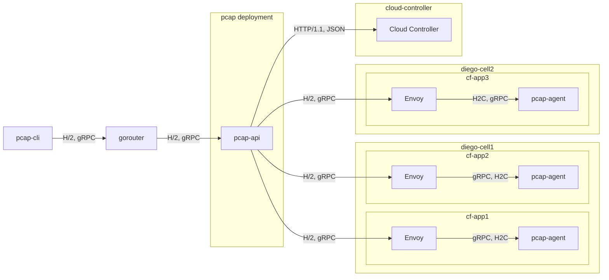
```mermaid
graph LR
    pcap-cli -->|H/2, gRPC| gorouter
    gorouter -->|H/2, gRPC| pcap-api

    subgraph pcap deployment
        pcap-api
    end
    
    subgraph diego-cell1
        subgraph cf-app1
            pcap-api -->|H/2, gRPC| c1e[Envoy]
            c1e -->|gRPC, H2C| c1[pcap-agent]
        end 
        subgraph cf-app2
            pcap-api -->|H/2, gRPC| c2e[Envoy]
            c2e -->|gRPC, H2C| c2[pcap-agent]
        end 
    end
    subgraph diego-cell2
        subgraph cf-app3
            pcap-api -->|H/2, gRPC| c3e[Envoy]
            c3e -->|H2C, gRPC| c3[pcap-agent]
        end 
    end
    subgraph cloud-controller
        pcap-api -->|HTTP/1.1, JSON| cc[Cloud Controller]
    end
```
Figure 1: The Cloud Foundry Application Capturing case

## BOSH Case Overview

Capturing data from BOSH deployments requires the pcap-agent on the individual BOSH VMs. The pcap-agent runs on a well-known port and takes care of mTLS verification.

The BOSH director is used to verify and find the requested target VMs' IP addresses. The BOSH UAA is used to verify the token provided by the client.

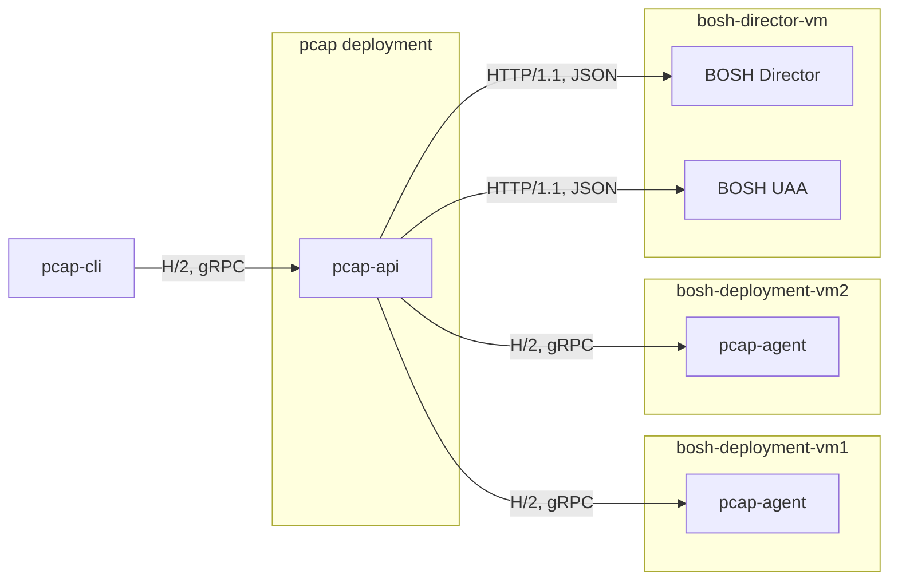
```mermaid
graph LR
    pcap-cli -->|H/2, gRPC| pcap-api

    subgraph pcap deployment
        pcap-api
    end
        
    subgraph bosh-deployment-vm1
        pcap-api -->|H/2, gRPC| a1[pcap-agent]
    end
    subgraph bosh-deployment-vm2
        pcap-api -->|H/2, gRPC| a2[pcap-agent]
    end

    subgraph bosh-director-vm
        pcap-api -->|HTTP/1.1, JSON| bosh[BOSH Director]
        pcap-api -->|HTTP/1.1, JSON| bosh-uaa[BOSH UAA]
    end
```

Figure 2: The BOSH Capturing case

## Interactions

### pcap-cli -> pcap-api
  - request status (version information, service alive)
  - capture request for:
    - CF Capture Request
    - BOSH Capture Request
  - Send stop request
### pcap-api
  - Status response
  - CF Capture Request
    - pcap-api -> Cloud Controller
      - Validate request, token
      - find endpoints (pcap-agent)
  - BOSH Capture Request
    - pcap-api -> BOSH Director
      - HTTP: Retrieve /info (also works without Auth)
      - HTTP: Retrieve deployment instances
    - pcap-api -> BOSH Director UAA
      - HTTP: Retrieve JWT token key
  - pcap-api -> pcap-agent
    - Status
    - Send Capture Request
    - Send stop request
### pcap-agent -> pcap-api
  - Send status
  - Send Capture Response
    - Message
      - Stop
      - Congestion
      - Error
        - Limit reached (e.g. number of concurrent capture requests exceeded, )
        - Invalid Request (e.g. malformed filter, device not found, etc.)
        - Runtime (any unexpected error occurring on the agent during capture. Contains as much information as possible and forward before terminating)
    - captured pcap data packet(s) - consider batching multiple packets in one Capture Response
### pcap-api -> pcap-cli

- Status
- captured pcap data packet
- Message
    - Stop confirmation
    - Capture status
        - Agent is gone
        - All agents stopped
        - Congestion
    - Errors
        - Limit reached (e.g. number of concurrent capture requests exceeded, )
        - Unauthorized
        - Invalid Request (e.g. malformed filter, Target not found, device not found, etc.)

## Data Structures

The following section defines the data structures, their use and fields' purpose in detail.

### Capture Request

A capture request contains the information needed to target a set of resources, from which to capture network traffic.

- **For CF**, a resource is a single application instance.
  - The capture request can target all instances at once by omitting specific application instance IDs
- **For BOSH**, a resource is a single BOSH VM.
  - The capture request can target individual VMs or all VMs in one or multiple instance groups of a BOSH deployment.

The capture request can contain a start or stop request. The start request can either be for CF or BOSH respectively:

* `start`: one of [CF App Start Capture Request](#cf-app-start-capture-request), [BOSH Start Capture Request](#bosh-start-capture-request)
* `stop`: a [Stop Capture Request](#stop-capture-request)

#### Common Fields for `pcap-agent`

The following attributes are part of all capture requests and define the details required for the `pcap-agent`.

| Parameter      | Type    | Required? | Default | Description                                                                                                                                               |
|----------------|---------|-----------|---------|-----------------------------------------------------------------------------------------------------------------------------------------------------------|
| `device`       | string  | yes       | `eth0`   | The device on the app container from which to capture the traffic                                                                                         |
| `filter`       | string  | no        |         | BPF Filter expression to use with tcpdump command to capture traffic.                                                                                     |
| `snaplen`      | integer | no        | 65535   | Limit the amount of data captured for each packet, see [SnapLen](https://wiki.wireshark.org/SnapLen)                                                      |

#### CF App Start Capture Request

| Parameter | Type | Required? | Default | Description                                                                                                                                                  |
|-----|-----|-----|-----|--------------------------------------------------------------------------------------------------------------------------------------------------------------|
|  | `Common` | yes | | All [common fields](#common-fields-for-pcap-agent) are included in a CF capture request                                                                      |
| `token`     | `string` | yes | | The UAA token for the user sending the capture request.                                                                                                      |
| `application_id` | `string` | yes | | The ID of the target application.                                                                                                                       |
| `type`        | `string` | no | `web`   | An app can have processes of different types, `web` being the default. This allows targeting processes of a specific type for this app.                      |
| `instance_ids` | `[]int` | no | `[]`  | List of instance indexes of the application. An empty list indicates that **all instances** should be captured. Mutually exclusive with `instance_guids`.    |
| `instance_guids` | `[]string` | no | `[]` | List of instance IDs for finer-grained targeting. An empty list indicates that **all instances** should be captured. Mutually exclusive with `instance_ids`. |

#### BOSH Start Capture Request

| Parameter        | Type       | Required? | Default | Description                                                                                                                                                         |
|------------------|------------|-----------|-----|---------------------------------------------------------------------------------------------------------------------------------------------------------------------|
|                  | `Common`   | yes       | | All [common fields](#common-fields-for-pcap-agent) are included in a CF capture request                                                                                                   |
| `token`          | `string`   | yes       | | The UAA token for the user sending the capture request.                                                                                                             |
| `deployment`     | `string`   | yes       | | The name of the target BOSH deployment.                                                                                                                             |
| `groups`         | `[]string` | yes       |    | A list of instance groups from which to capture. **Must contain at least one instance group**.                                                                      |
| `instance_ids`   | `[]int`    | no        | `[]` | List of instance indexes of the application. An empty list indicates that **all instances** should be captured. Mutually exclusive with `instance_guids`.           |
| `instance_guids` | `[]string` | no        | `[]` | List of instance IDs for finer-grained targeting. An empty list indicates that **all instances** should be captured. Mutually exclusive with `instance_ids`. |

#### Stop Capture Request

The stop capture request just indicates that the capture on the current stream is requested to be stopped gracefully.

### Message

| Parameter      | Type               | Required? | Description                                                                                                                                          |
|----------------|--------------------|-----------|------------------------------------------------------------------------------------------------------------------------------------------------------|
| `message_type` | `enum MessageType` | yes       | The type of message sent. This allows for logic based on the message type                                                                            |
| `origin`       | `string`           | yes       | The sender of this message, e.g. `pcap-api-[deployment guid]`, `pcap-agent-[instance_id]`                                                            |
| `message`      | `string`           | no        | The detailed message, human readable, explaining the reason for this message. Optional but recommended, as it could be shown on the CLI to the user. |

#### Enum `MessageType`

| Value                   | Description                                                                                                                                                       |
|-------------------------|-------------------------------------------------------------------------------------------------------------------------------------------------------------------|
| `INSTANCE_NOT_FOUND`    | One of the requested instances does not exist but there is at least one instance to capture from. MUST be sent as soon as possible.                               |
| `INSTANCE_DISCONNECTED` | One instance failed during capturing but there are still instances left to capture from. The detailed message should contain information about the stopped party. |
| `INSTANCE_STOPPED`      | A single agent has stopped gracefully. The detailed message should contain information about the stopped party.                                                   |
| `START_CAPTURE_FAILED`  | Starting the capture from a specific instance has failed.                                                                                                         |
| `INVALID_REQUEST`       | The request could not be fulfilled, e.g. because the app or BOSH deployment with the requested name do not exist.                                                 |
| `CONGESTED`             | Some participant on the path is congested to the point of discarding data. The detailed message should contain the congested party.                               |
| `CAPTURE_STOPPED`       | Confirmation that the capture has stopped gracefully. All of the targeted agents have stopped.                                                                    |
| `LIMIT_REACHED`         | Some limit has been reached, e.g. number of concurrent requests, time, bytes, etc.; Message details identifies, which limit has been reached.                     |
| `UNAUTHORIZED`          | The token sent by the client is rejected (e.g. invalid, timed out, etc.). Detail for the rejection in the message.                                                |                                                                                                     |
| `MTLS_ERROR`        | An error happened while attempting mTLS communication with PCAP components, independent of the client.         |
| `NO_CAPTURE_RUNNING`    | A Stop Capture Request is received but no capture is running.                                                                                                     |

### Status

| Parameter | Type          | Required? | Description                                                                                                                             |
|-----------|---------------|-----------|-----------------------------------------------------------------------------------------------------------------------------------------|
| `health`  | `enum Health` | yes       | The type of message sent. This allows for logic based on the message type                                                               |
| `version` | `string`      | yes       | Version number of the component. Can be used to ensure communication with compatible versions, and cut-off of unsupported old versions. |
| `status`  | `string`      | yes       | A human readable status message.                                                                                                        |
| `cf`      | `boolean`     | no        | Supports CF requests (only for pcap-api)                                                                                                |                                                                                               | 
| `bosh`    | `boolean`     | no        | Supports BOSH requests (only for pcap-api)                                                                                              |                                                                                               | 

#### Enum `Health`

| Value       | Description                                                                                                                                  |
|-------------|----------------------------------------------------------------------------------------------------------------------------------------------|
| `OK`        | Everything is nominal.                                                                                                                       |
| `DRAINING`  | This instance is currently being shut down and is draining its remaining connections.                                                        |
| `UNHEALTHY` | Communication to some of the components is interrupted, e.g. BOSH Director, UAA, Cloud Controller, pcap-api (in the case of the pcap-agent)? |

### PCAP Data

| Parameter | Type        | Description                                                               |
|-----------|-------------|---------------------------------------------------------------------------|
| `data`    | `[]bytes`   | One, potentially multiple, complete packets as captured from the network. |

### Capture Response

Capture Response is a stream that may contain multiple of the following data structures:

* [PCAP Data](#pcap-data)
* [Message](#message)

Messages are used to communicate status and errors.

## Use Cases

The following use cases were considered and should cover the 'happy path' as well as error conditions:

* Regular request with clean shutdown
* Authentication issue(s)
* Agent disconnects unexpectedly
* Request is invalid and cannot be started
    * Identified by the pcap-api
    * Identified by the pcap-agents
    * Some agents cannot comply with the request and don't start
    * Resource Limit
* Congestion
  * on pcap-agent
  * on pcap-api

### Initialization

For **BOSH**, on startup of pcap-api, the BOSH director needs to be contacted in order to:
* make sure the URL is reachable and the endpoint is a BOSH director
* retrieve the URL for the BOSH UAA

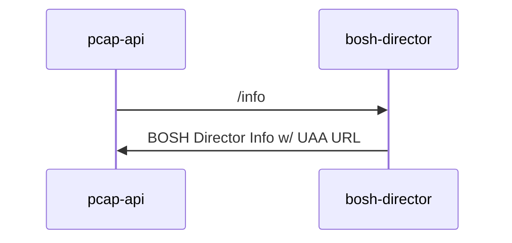
```mermaid
sequenceDiagram
    pcap-api ->> bosh-director: /info
    bosh-director ->> pcap-api: BOSH Director Info w/ UAA URL
```

For **CF**, on startup of pcap-api, the Cloud Controller needs t obe contacted in order to:
* The Cloud Controller base URL
* The UAA Base URL

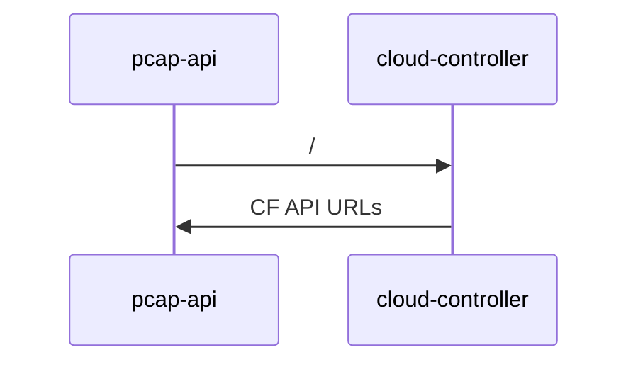
```mermaid
sequenceDiagram
    pcap-api ->> cloud-controller: /
    cloud-controller ->> pcap-api: CF API URLs
```

### Regular Request with Clean Shutdown

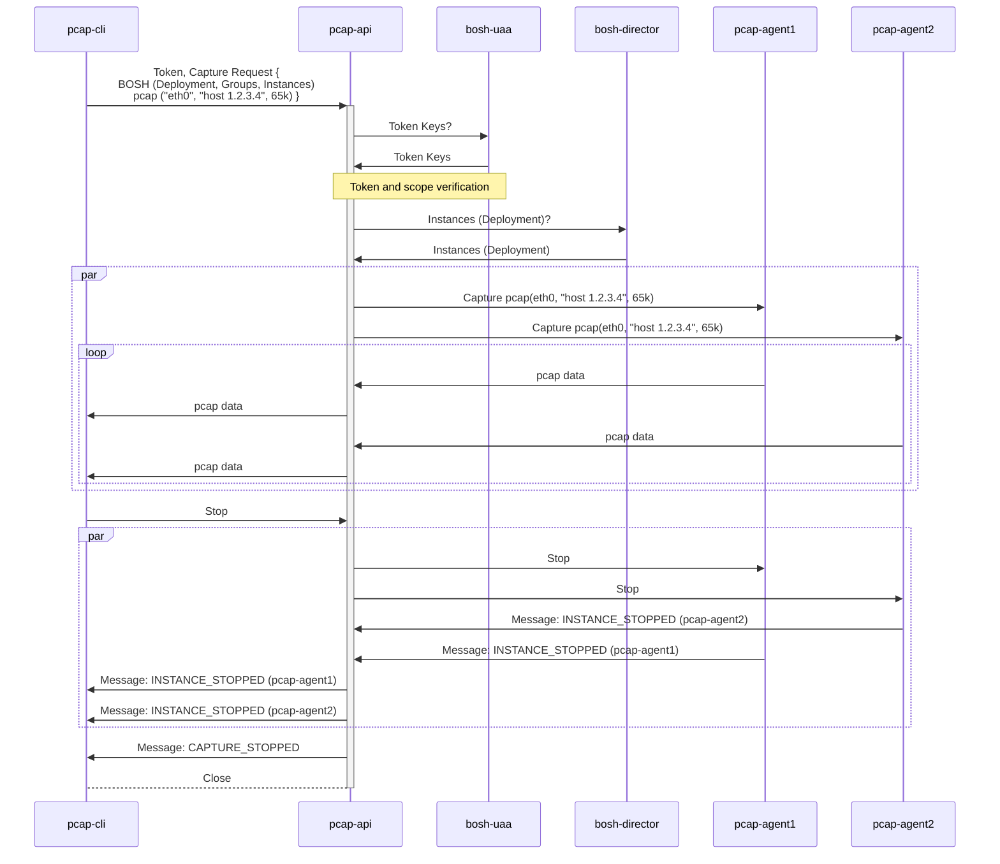
```mermaid
sequenceDiagram
    pcap-cli ->>+ pcap-api: Token, Capture Request {<br/>BOSH (Deployment, Groups, Instances)<br/>pcap ("eth0", "host 1.2.3.4", 65k) }
    pcap-api ->> bosh-uaa: Token Keys?
    bosh-uaa ->> pcap-api: Token Keys
    note over pcap-api, bosh-uaa: Token and scope verification    
    pcap-api ->> bosh-director: Instances (Deployment)?
    bosh-director ->> pcap-api: Instances (Deployment)
    par
        pcap-api ->> pcap-agent1: Capture pcap(eth0, "host 1.2.3.4", 65k)
        pcap-api ->> pcap-agent2: Capture pcap(eth0, "host 1.2.3.4", 65k)
        loop
            pcap-agent1 ->> pcap-api: pcap data
            pcap-api ->> pcap-cli: pcap data
            pcap-agent2 ->> pcap-api: pcap data
            pcap-api ->> pcap-cli: pcap data
        end
    end
    pcap-cli ->> pcap-api: Stop
    par
        pcap-api ->> pcap-agent1: Stop
        pcap-api ->> pcap-agent2: Stop
    pcap-agent2 ->> pcap-api: Message: INSTANCE_STOPPED (pcap-agent2)
    pcap-agent1 ->> pcap-api: Message: INSTANCE_STOPPED (pcap-agent1)
    pcap-api ->> pcap-cli: Message: INSTANCE_STOPPED (pcap-agent1)
    pcap-api ->> pcap-cli: Message: INSTANCE_STOPPED (pcap-agent2)
    end

    pcap-api ->> pcap-cli: Message: CAPTURE_STOPPED
    pcap-api -->- pcap-cli: Close
```

### Authentication Failures

On authentication failures, the message `UNAUTHORIZED` is sent back. The message detail explains the reason for rejection, e.g. signature check failed, token expired, etc.

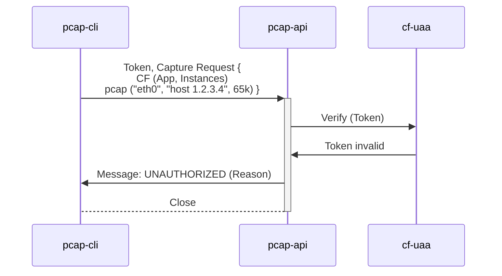
```mermaid
sequenceDiagram
    pcap-cli ->>+ pcap-api: Token, Capture Request {<br/>CF (App, Instances)<br/>pcap ("eth0", "host 1.2.3.4", 65k) }
    pcap-api ->> cf-uaa: Verify (Token)
    cf-uaa ->> pcap-api: Token invalid
    
    pcap-api ->> pcap-cli: Message: UNAUTHORIZED (Reason)
    pcap-api -->- pcap-cli: Close
```

### Unexpected Disconnects

A clean shutdown of components and notification is necessary when either of the components disconnect unexpectedly.

When a pcap-agent terminates while capturing, e.g. due to crash or because its connection is lost, pcap-api will notify the pcap-cli that this particular agent is now disconnected.

**NOTE:** This behaviour needs to work correctly, even when no `FIN` is sent from the client, e.g. the node disappears and the request times out.

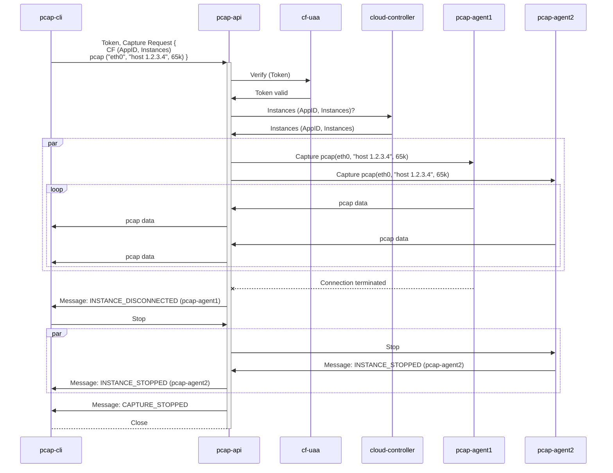
```mermaid
sequenceDiagram
    pcap-cli ->>+ pcap-api: Token, Capture Request {<br/>CF (AppID, Instances)<br/>pcap ("eth0", "host 1.2.3.4", 65k) }
    pcap-api ->> cf-uaa: Verify (Token)
    cf-uaa ->> pcap-api: Token valid
    pcap-api ->> cloud-controller: Instances (AppID, Instances)?
    cloud-controller ->> pcap-api: Instances (AppID, Instances)
    par
        pcap-api ->> pcap-agent1: Capture pcap(eth0, "host 1.2.3.4", 65k)
        pcap-api ->> pcap-agent2: Capture pcap(eth0, "host 1.2.3.4", 65k)
        loop
            pcap-agent1 ->> pcap-api: pcap data
            pcap-api ->> pcap-cli: pcap data
            pcap-agent2 ->> pcap-api: pcap data
            pcap-api ->> pcap-cli: pcap data
        end
    end
    pcap-agent1 --X pcap-api: Connection terminated
    pcap-api ->> pcap-cli: Message: INSTANCE_DISCONNECTED (pcap-agent1)
    pcap-cli ->> pcap-api: Stop
    par
        pcap-api ->> pcap-agent2: Stop
    pcap-agent2 ->> pcap-api: Message: INSTANCE_STOPPED (pcap-agent2)
    pcap-api ->> pcap-cli: Message: INSTANCE_STOPPED (pcap-agent2)
    end

    pcap-api ->> pcap-cli: Message: CAPTURE_STOPPED
    pcap-api -->- pcap-cli: Close
```

In the case that the pcap-cli disconnects without stopping the capture, the pcap-api will stop all capture requests on pcap-agents for this client.

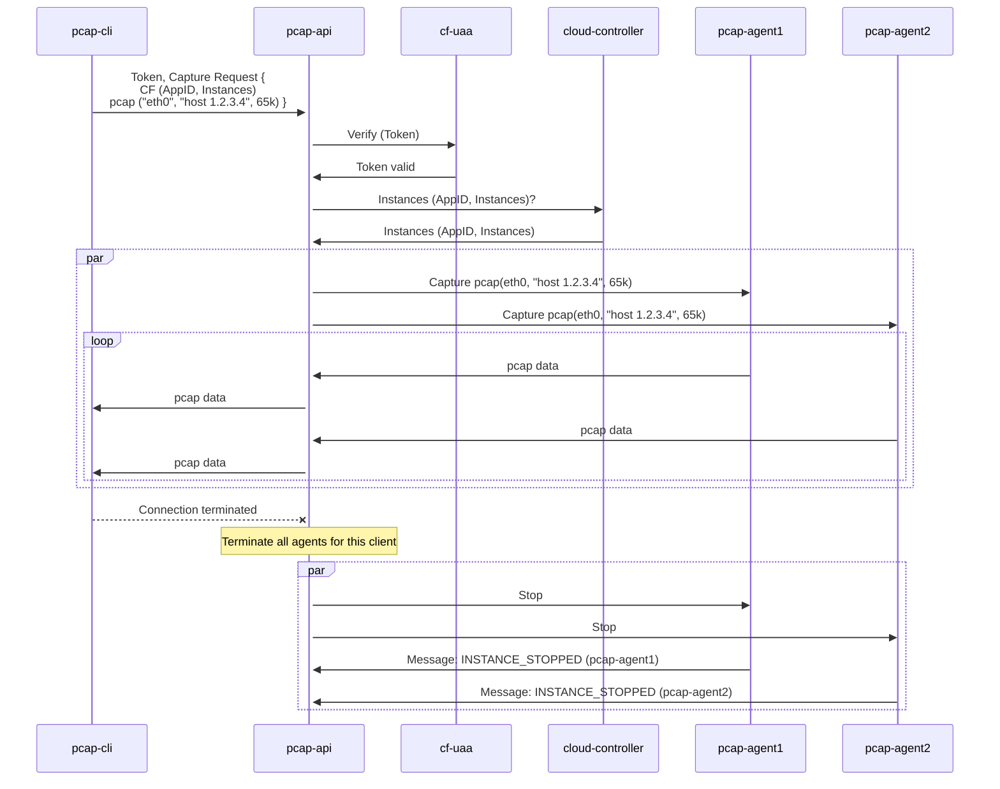
```mermaid
sequenceDiagram
    pcap-cli ->>+ pcap-api: Token, Capture Request {<br/>CF (AppID, Instances)<br/>pcap ("eth0", "host 1.2.3.4", 65k) }
    pcap-api ->> cf-uaa: Verify (Token)
    cf-uaa ->> pcap-api: Token valid
    pcap-api ->> cloud-controller: Instances (AppID, Instances)?
    cloud-controller ->> pcap-api: Instances (AppID, Instances)
    par
        pcap-api ->> pcap-agent1: Capture pcap(eth0, "host 1.2.3.4", 65k)
        pcap-api ->> pcap-agent2: Capture pcap(eth0, "host 1.2.3.4", 65k)
        loop
            pcap-agent1 ->> pcap-api: pcap data
            pcap-api ->> pcap-cli: pcap data
            pcap-agent2 ->> pcap-api: pcap data
            pcap-api ->> pcap-cli: pcap data
        end
    end
    pcap-cli --X pcap-api: Connection terminated
    note over pcap-api: Terminate all agents for this client
    par
    pcap-api ->> pcap-agent1: Stop
    pcap-api ->> pcap-agent2: Stop
        pcap-agent1 ->> pcap-api: Message: INSTANCE_STOPPED (pcap-agent1)
        pcap-agent2 ->> pcap-api: Message: INSTANCE_STOPPED (pcap-agent2)
    end
```

In the case that a long-running request is terminated by Gorouter due to context deadline, the request will be terminated and the CLI informed by Gorouter. The pcap-agent needs to clean up in this case.

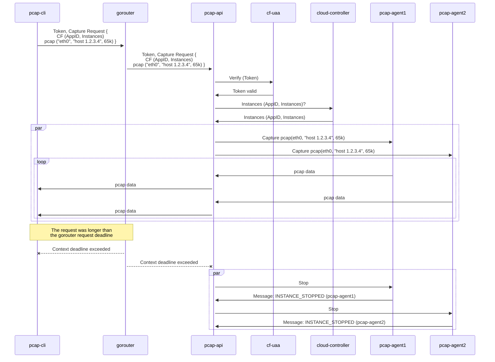
```mermaid
sequenceDiagram
    pcap-cli ->>+ gorouter: Token, Capture Request {<br/>CF (AppID, Instances)<br/>pcap ("eth0", "host 1.2.3.4", 65k) }
    gorouter ->>+ pcap-api: Token, Capture Request {<br/>CF (AppID, Instances)<br/>pcap ("eth0", "host 1.2.3.4", 65k) }
    pcap-api ->> cf-uaa: Verify (Token)
    cf-uaa ->> pcap-api: Token valid
    pcap-api ->> cloud-controller: Instances (AppID, Instances)?
    cloud-controller ->> pcap-api: Instances (AppID, Instances)
    par
        pcap-api ->> pcap-agent1: Capture pcap(eth0, "host 1.2.3.4", 65k)
        pcap-api ->> pcap-agent2: Capture pcap(eth0, "host 1.2.3.4", 65k)
        loop
            pcap-agent1 ->> pcap-api: pcap data
            pcap-api ->> pcap-cli: pcap data
            pcap-agent2 ->> pcap-api: pcap data
            pcap-api ->> pcap-cli: pcap data
        end
    end
    note over pcap-cli, gorouter: The request was longer than<br/>the gorouter request deadline
    gorouter --X pcap-cli: Context deadline exceeded
    gorouter --X pcap-api: Context deadline exceeded
    par
        pcap-api ->> pcap-agent1: Stop
        pcap-agent1 ->> pcap-api: Message: INSTANCE_STOPPED (pcap-agent1)
        pcap-api ->> pcap-agent2: Stop
        pcap-agent2 ->> pcap-api: Message: INSTANCE_STOPPED (pcap-agent2)
    end
```

### Invalid Requests

Requests can be invalid for many reasons.

The following diagram presents the following invalid request reasons for BOSH captures:
* Invalid deployment name
* Invalid instance group
* No instances matching the request

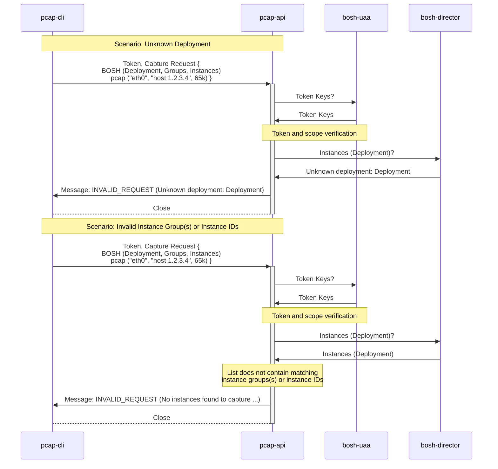
```mermaid
sequenceDiagram
    note over pcap-cli, pcap-api: Scenario: Unknown Deployment
    pcap-cli ->>+ pcap-api: Token, Capture Request {<br/>BOSH (Deployment, Groups, Instances)<br/>pcap ("eth0", "host 1.2.3.4", 65k) }
    pcap-api ->> bosh-uaa: Token Keys?
    bosh-uaa ->> pcap-api: Token Keys
    note over pcap-api, bosh-uaa: Token and scope verification    
    pcap-api ->> bosh-director: Instances (Deployment)?
    bosh-director ->> pcap-api: Unknown deployment: Deployment
    pcap-api ->> pcap-cli: Message: INVALID_REQUEST (Unknown deployment: Deployment)
    pcap-api -->- pcap-cli: Close

    note over pcap-cli, pcap-api: Scenario: Invalid Instance Group(s) or Instance IDs
    pcap-cli ->>+ pcap-api: Token, Capture Request {<br/>BOSH (Deployment, Groups, Instances)<br/>pcap ("eth0", "host 1.2.3.4", 65k) }
    pcap-api ->> bosh-uaa: Token Keys?
    bosh-uaa ->> pcap-api: Token Keys
    note over pcap-api, bosh-uaa: Token and scope verification    
    pcap-api ->> bosh-director: Instances (Deployment)?
    bosh-director ->> pcap-api: Instances (Deployment)
    note over pcap-api: List does not contain matching<br/>instance groups(s) or instance IDs
    pcap-api ->> pcap-cli: Message: INVALID_REQUEST (No instances found to capture ...)
    pcap-api -->- pcap-cli: Close
    
```

Availability issues:

* No pcap-agents available in BOSH case (e.g. not deployed for this deployment)
* PCAP permission for the space is not enabled in the CF case

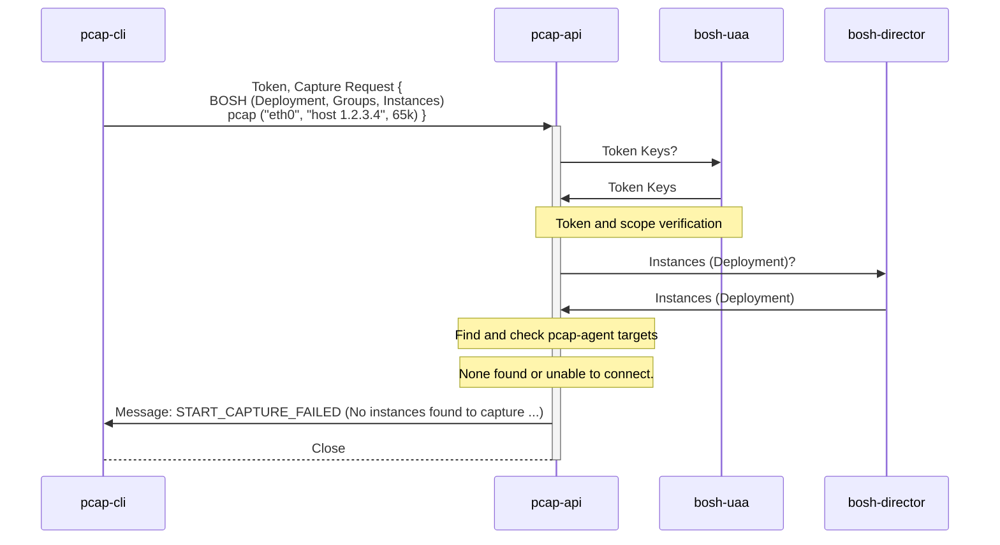
```mermaid
sequenceDiagram
    pcap-cli ->>+ pcap-api: Token, Capture Request {<br/>BOSH (Deployment, Groups, Instances)<br/>pcap ("eth0", "host 1.2.3.4", 65k) }
    pcap-api ->> bosh-uaa: Token Keys?
    bosh-uaa ->> pcap-api: Token Keys
    note over pcap-api, bosh-uaa: Token and scope verification    
    pcap-api ->> bosh-director: Instances (Deployment)?
    bosh-director ->> pcap-api: Instances (Deployment)
    note over pcap-api: Find and check pcap-agent targets
    note over pcap-api: None found or unable to connect.
    
    pcap-api ->> pcap-cli: Message: START_CAPTURE_FAILED (No instances found to capture ...)
    pcap-api -->- pcap-cli: Close
```

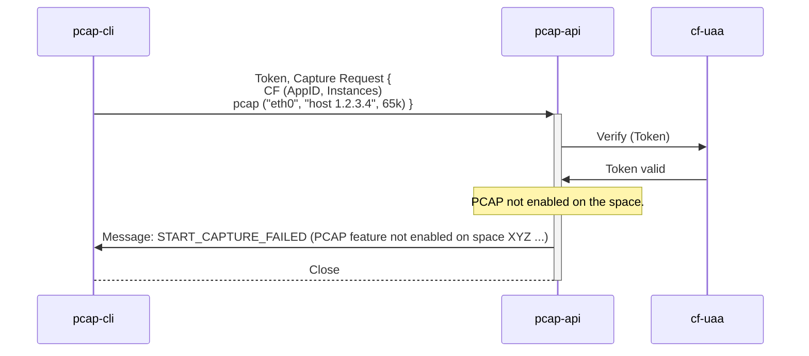
```mermaid
sequenceDiagram
    pcap-cli ->>+ pcap-api: Token, Capture Request {<br/>CF (AppID, Instances)<br/>pcap ("eth0", "host 1.2.3.4", 65k) }
    pcap-api ->> cf-uaa: Verify (Token)
    cf-uaa ->> pcap-api: Token valid
    note over pcap-api: PCAP not enabled on the space.
    
    pcap-api ->> pcap-cli: Message: START_CAPTURE_FAILED (PCAP feature not enabled on space XYZ ...)
    pcap-api -->- pcap-cli: Close
```

Issues discovered by pcap-agent:
* Invalid snaplen
* Invalid / not available device
* Invalid syntax of filter
  * Open Question: pre-check on the pcap-cli/pcap-agent?

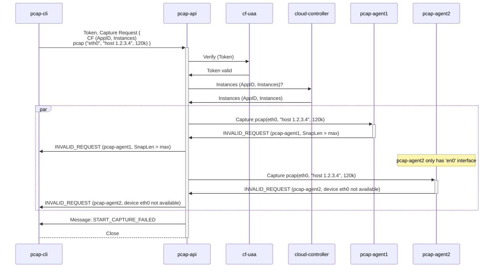
```mermaid
sequenceDiagram
    pcap-cli ->>+ pcap-api: Token, Capture Request {<br/>CF (AppID, Instances)<br/>pcap ("eth0", "host 1.2.3.4", 120k) }
    pcap-api ->> cf-uaa: Verify (Token)
    cf-uaa ->> pcap-api: Token valid
    pcap-api ->> cloud-controller: Instances (AppID, Instances)?
    cloud-controller ->> pcap-api: Instances (AppID, Instances)
    par
        pcap-api ->>+ pcap-agent1: Capture pcap(eth0, "host 1.2.3.4", 120k)
        pcap-agent1 ->>- pcap-api: INVALID_REQUEST (pcap-agent1, SnapLen > max)
        pcap-api ->> pcap-cli: INVALID_REQUEST (pcap-agent1, SnapLen > max)
    
        note over pcap-agent2: pcap-agent2 only has 'en0' interface
        pcap-api ->>+ pcap-agent2: Capture pcap(eth0, "host 1.2.3.4", 120k)
        pcap-agent2 ->>- pcap-api: INVALID_REQUEST (pcap-agent2, device eth0 not available)
        pcap-api ->> pcap-cli: INVALID_REQUEST (pcap-agent2, device eth0 not available)
    end
    
    pcap-api ->> pcap-cli: Message: START_CAPTURE_FAILED
    pcap-api -->- pcap-cli: Close
```

The 'invalid filter' use case needs to be handled by the pcap-agent (i.e. sending back the appropriate message and terminating this request), but should ideally be avoided in the pcap-cli or latest pcap-api already by checking the BPF filter syntax before sending it on to the pcap-agent.

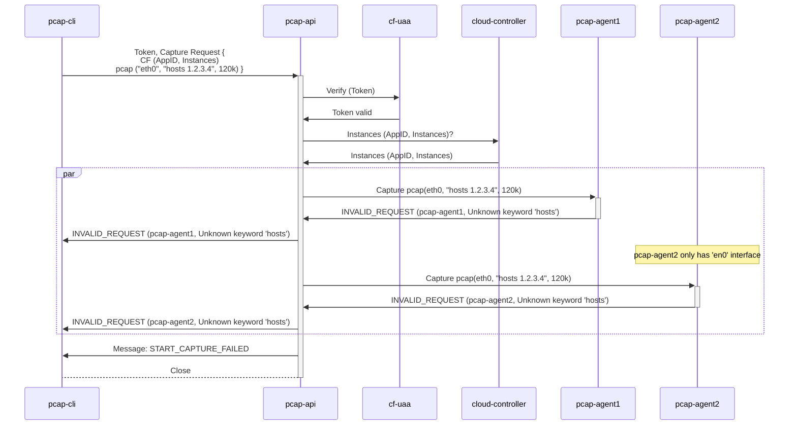
```mermaid
sequenceDiagram
    pcap-cli ->>+ pcap-api: Token, Capture Request {<br/>CF (AppID, Instances)<br/>pcap ("eth0", "hosts 1.2.3.4", 120k) }
    pcap-api ->> cf-uaa: Verify (Token)
    cf-uaa ->> pcap-api: Token valid
    pcap-api ->> cloud-controller: Instances (AppID, Instances)?
    cloud-controller ->> pcap-api: Instances (AppID, Instances)
    par
        pcap-api ->>+ pcap-agent1: Capture pcap(eth0, "hosts 1.2.3.4", 120k)
        pcap-agent1 ->>- pcap-api: INVALID_REQUEST (pcap-agent1, Unknown keyword 'hosts')
        pcap-api ->> pcap-cli: INVALID_REQUEST (pcap-agent1, Unknown keyword 'hosts')
    
        note over pcap-agent2: pcap-agent2 only has 'en0' interface
        pcap-api ->>+ pcap-agent2: Capture pcap(eth0, "hosts 1.2.3.4", 120k)
        pcap-agent2 ->>- pcap-api: INVALID_REQUEST (pcap-agent2, Unknown keyword 'hosts')
        pcap-api ->> pcap-cli: INVALID_REQUEST (pcap-agent2, Unknown keyword 'hosts')
    end
    
    pcap-api ->> pcap-cli: Message: START_CAPTURE_FAILED
    pcap-api -->- pcap-cli: Close
```

Connections to mTLS can fail due to misconfiguration or expired certificates.

The fact that an mTLS connection failed should be forwarded to the CLI.

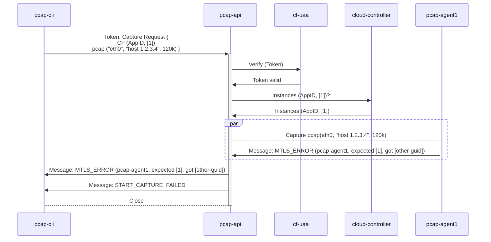
```mermaid
sequenceDiagram
    pcap-cli ->>+ pcap-api: Token, Capture Request {<br/>CF (AppID, [1])<br/>pcap ("eth0", "host 1.2.3.4", 120k) }
    pcap-api ->> cf-uaa: Verify (Token)
    cf-uaa ->> pcap-api: Token valid
    pcap-api ->> cloud-controller: Instances (AppID, [1])?
    cloud-controller ->> pcap-api: Instances (AppID, [1])
    par
        pcap-api -->+ pcap-agent1: Capture pcap(eth0, "host 1.2.3.4", 120k)
        pcap-agent1 ->> pcap-api: Message: MTLS_ERROR (pcap-agent1, expected [1], got [other-guid])
    end

    pcap-api ->> pcap-cli: Message: MTLS_ERROR (pcap-agent1, expected [1], got [other-guid])
    
    pcap-api ->> pcap-cli: Message: START_CAPTURE_FAILED
    pcap-api -->- pcap-cli: Close
```

### Resource Limits

The amount of concurrently running captures (for each pcap-api instance and each pcap-agent instance) in order to avoid excessive use, overload, etc.

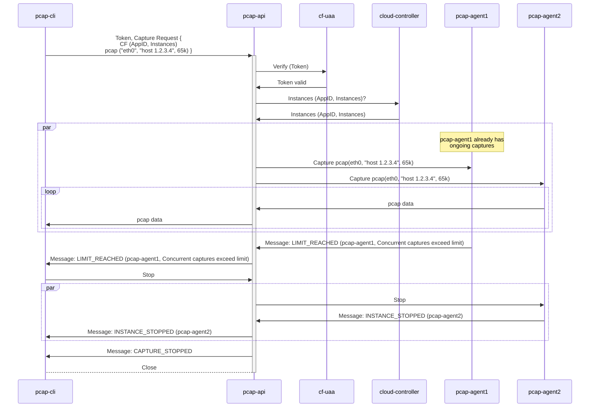
```mermaid
sequenceDiagram
    pcap-cli ->>+ pcap-api: Token, Capture Request {<br/>CF (AppID, Instances)<br/>pcap ("eth0", "host 1.2.3.4", 65k) }
    pcap-api ->> cf-uaa: Verify (Token)
    cf-uaa ->> pcap-api: Token valid
    pcap-api ->> cloud-controller: Instances (AppID, Instances)?
    cloud-controller ->> pcap-api: Instances (AppID, Instances)
    par
        note over pcap-agent1: pcap-agent1 already has<br/>ongoing captures
        pcap-api ->> pcap-agent1: Capture pcap(eth0, "host 1.2.3.4", 65k)
        pcap-api ->> pcap-agent2: Capture pcap(eth0, "host 1.2.3.4", 65k)
        loop
            pcap-agent2 ->> pcap-api: pcap data
            pcap-api ->> pcap-cli: pcap data
        end
    end
    pcap-agent1 ->> pcap-api: Message: LIMIT_REACHED (pcap-agent1, Concurrent captures exceed limit)
    pcap-api ->> pcap-cli: Message: LIMIT_REACHED (pcap-agent1, Concurrent captures exceed limit)
    pcap-cli ->> pcap-api: Stop
    par
        pcap-api ->> pcap-agent2: Stop
    pcap-agent2 ->> pcap-api: Message: INSTANCE_STOPPED (pcap-agent2)
    pcap-api ->> pcap-cli: Message: INSTANCE_STOPPED (pcap-agent2)
    end

    pcap-api ->> pcap-cli: Message: CAPTURE_STOPPED
    pcap-api -->- pcap-cli: Close
```

The limit for a particular client IP could also be reached with too many ongoing concurrent capture requests. To avoid synchronisation issues, the limit is enforced by each pcap-api instance, not globally.

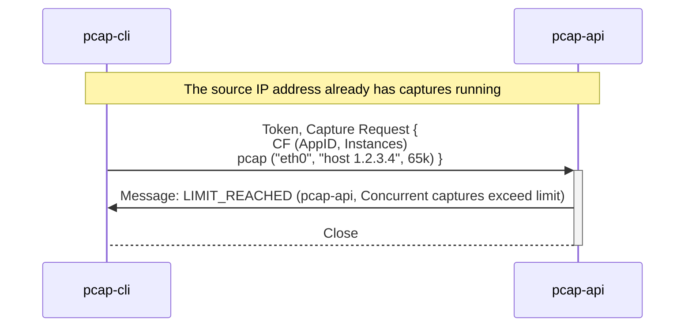
```mermaid
sequenceDiagram
    note over pcap-cli, pcap-api: The source IP address already has captures running
    pcap-cli ->>+ pcap-api: Token, Capture Request {<br/>CF (AppID, Instances)<br/>pcap ("eth0", "host 1.2.3.4", 65k) }
    pcap-api ->> pcap-cli: Message: LIMIT_REACHED (pcap-api, Concurrent captures exceed limit)
    pcap-api -->- pcap-cli: Close
```

The pcap-agents have limited buffers for captured network traffic. When they cannot send their data to pcap-api fast enough, the buffer may fill up. To continue operation, pcap-agent will discard network packets until the buffer can fit further messages.

Consider that the `CONGESTED` message also takes up space in the buffer.

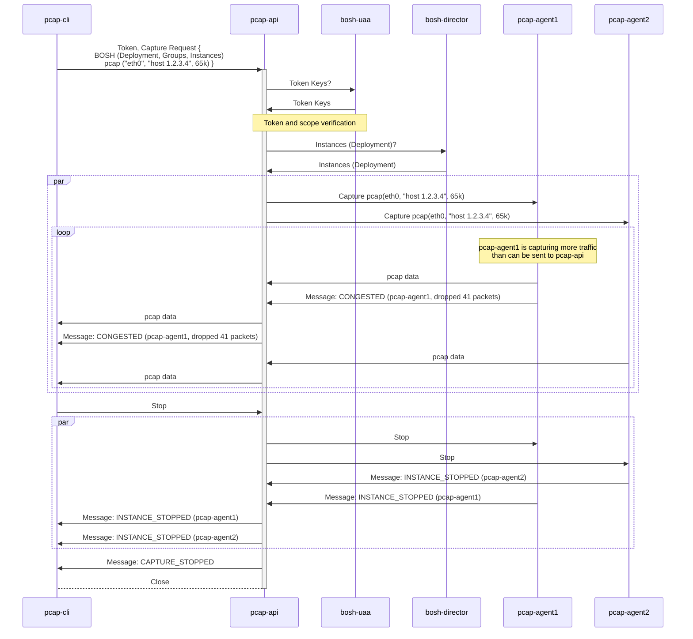
```mermaid
sequenceDiagram
    pcap-cli ->>+ pcap-api: Token, Capture Request {<br/>BOSH (Deployment, Groups, Instances)<br/>pcap ("eth0", "host 1.2.3.4", 65k) }
    pcap-api ->> bosh-uaa: Token Keys?
    bosh-uaa ->> pcap-api: Token Keys
    note over pcap-api, bosh-uaa: Token and scope verification    
    pcap-api ->> bosh-director: Instances (Deployment)?
    bosh-director ->> pcap-api: Instances (Deployment)
    par
        pcap-api ->> pcap-agent1: Capture pcap(eth0, "host 1.2.3.4", 65k)
        pcap-api ->> pcap-agent2: Capture pcap(eth0, "host 1.2.3.4", 65k)
        loop
            note over pcap-agent1: pcap-agent1 is capturing more traffic<br/>than can be sent to pcap-api
            pcap-agent1 ->> pcap-api: pcap data
            pcap-agent1 ->> pcap-api: Message: CONGESTED (pcap-agent1, dropped 41 packets)
            pcap-api ->> pcap-cli: pcap data
            pcap-api ->> pcap-cli: Message: CONGESTED (pcap-agent1, dropped 41 packets)
            pcap-agent2 ->> pcap-api: pcap data
            pcap-api ->> pcap-cli: pcap data
        end
    end
    pcap-cli ->> pcap-api: Stop
    par
        pcap-api ->> pcap-agent1: Stop
        pcap-api ->> pcap-agent2: Stop
    pcap-agent2 ->> pcap-api: Message: INSTANCE_STOPPED (pcap-agent2)
    pcap-agent1 ->> pcap-api: Message: INSTANCE_STOPPED (pcap-agent1)
    pcap-api ->> pcap-cli: Message: INSTANCE_STOPPED (pcap-agent1)
    pcap-api ->> pcap-cli: Message: INSTANCE_STOPPED (pcap-agent2)
    end

    pcap-api ->> pcap-cli: Message: CAPTURE_STOPPED
    pcap-api -->- pcap-cli: Close
```

When the pcap-api's buffers towards the client fill up, the pcap-api emits `CONGESTED` messages itself and drops packets to keep the request within limits. This usually happens when the connection to the client is slower than the data rate of the captured network traffic.

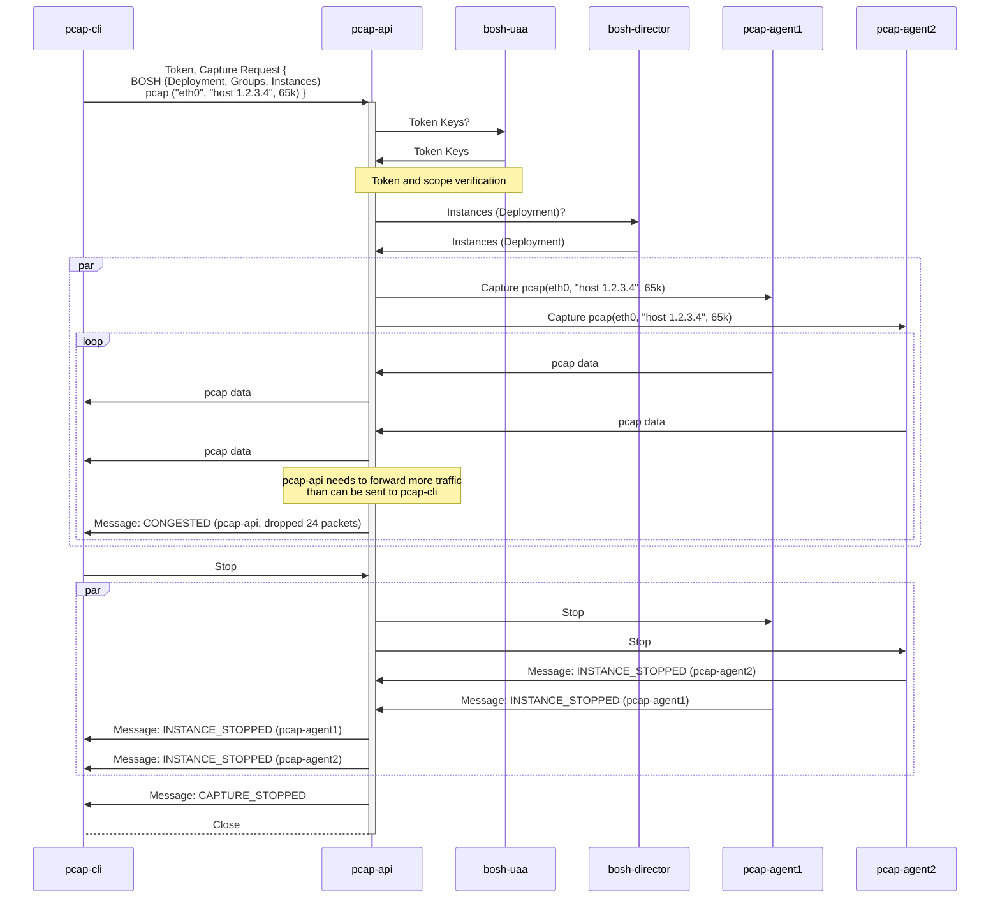
```mermaid
sequenceDiagram
    pcap-cli ->>+ pcap-api: Token, Capture Request {<br/>BOSH (Deployment, Groups, Instances)<br/>pcap ("eth0", "host 1.2.3.4", 65k) }
    pcap-api ->> bosh-uaa: Token Keys?
    bosh-uaa ->> pcap-api: Token Keys
    note over pcap-api, bosh-uaa: Token and scope verification    
    pcap-api ->> bosh-director: Instances (Deployment)?
    bosh-director ->> pcap-api: Instances (Deployment)
    par
        pcap-api ->> pcap-agent1: Capture pcap(eth0, "host 1.2.3.4", 65k)
        pcap-api ->> pcap-agent2: Capture pcap(eth0, "host 1.2.3.4", 65k)
        loop
            pcap-agent1 ->> pcap-api: pcap data
            pcap-api ->> pcap-cli: pcap data
            pcap-agent2 ->> pcap-api: pcap data
            pcap-api ->> pcap-cli: pcap data
            note over pcap-api: pcap-api needs to forward more traffic<br/>than can be sent to pcap-cli 
            pcap-api ->> pcap-cli: Message: CONGESTED (pcap-api, dropped 24 packets)
        end
    end
            
    pcap-cli ->> pcap-api: Stop
    par
        pcap-api ->> pcap-agent1: Stop
        pcap-api ->> pcap-agent2: Stop
    pcap-agent2 ->> pcap-api: Message: INSTANCE_STOPPED (pcap-agent2)
    pcap-agent1 ->> pcap-api: Message: INSTANCE_STOPPED (pcap-agent1)
    pcap-api ->> pcap-cli: Message: INSTANCE_STOPPED (pcap-agent1)
    pcap-api ->> pcap-cli: Message: INSTANCE_STOPPED (pcap-agent2)
    end

    pcap-api ->> pcap-cli: Message: CAPTURE_STOPPED
    pcap-api -->- pcap-cli: Close
```
