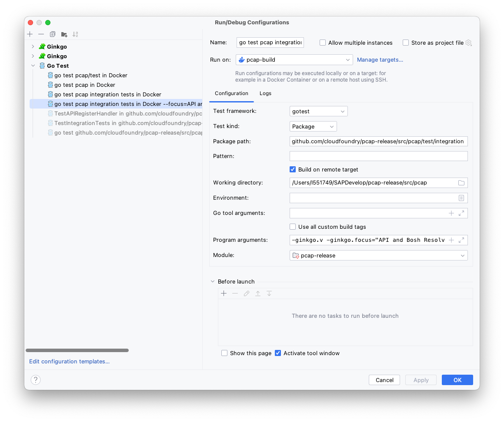

# PCAP


## Generating the gRPC stubs

Set up the `protoc` compiler with output to gRPC:
https://grpc.io/docs/languages/go/quickstart/

```shell
brew install protobuf

go install google.golang.org/protobuf/cmd/protoc-gen-go@v1.28
go install google.golang.org/grpc/cmd/protoc-gen-go-grpc@v1.2
```

## Running on MacOS (including Tests)

You might end up with errors complaining about not having access to capture from local network interfaces.

Change the group for the BPF devices to `staff`:

```shell
sudo chgrp staff /dev/bpf*; sudo chmod g+rw /dev/bpf*; ls -la /dev/bpf*
```

Alternatively:

[Wireshark guide on installing and running on MacOS](https://www.wireshark.org/docs/wsug_html_chunked/ChBuildInstallOSXInstall.html).

Install `ChmodBPF`, available as part of Wireshark.

The path to the installer can be found in Wireshark > About Wireshark > Folders, MacOS Extras.

The installer is called `Install ChmodBPF.pkg`.

### Running the tests on MacOS

All unit tests can be run locally via `go test`. The integration tests are included in `go test ./...` however and require some special handling.

The integration tests open mock servers on different IPs on the loopback device in the CIDR `127.0.0.0/8`.
MacOS does not by default support addresses other than `127.0.0.1`. It can be configured via aliases, but attempts to do so have not led to successful test execution.

Instead, a Dockerfile and docker-compose file are provided, which will automatically execute all tests (go test and ginkgo tests via test suite).

```shell
cd src/pcap
# the dockerfile is relative to src/pcap and mounts the current code as volume into the container.
docker compose up
```

This will build the image from `Dockerfile` and run `go test -v ./...`. This should give you confidence in the tests completing successfully.

### Running in IntelliJ

Using the Dockerfile or Docker Compose file, you can also run the tests using the Go integration in IntelliJ.

When selecting the run configuration, set up a Docker run target, either with Docker or Docker Compose. [Documentation on setting up run targets](https://www.jetbrains.com/help/idea/run-targets.html#target-types) os available from JetBrains.

### Running Ginkgo Tests in IntelliJ and Docker

There is a [Ginkgo plugin for IntelliJ](https://plugins.jetbrains.com/plugin/17554-ginkgo), which helps develop ginkgo tests. It can be used to visualize the structure of the test file (via the Structure view) and execute specific tests in Focus mode.

Some of the integration tests require the aforementioned multiple IP addresses and will not run directly. The Ginkgo plugin does unfortunately not integrate with run targets.

A run configuration with `go test` can be created, which will call the Ginkgo tests via Test Suite integration.
Furthermore, Ginkgo command line flags can be passed on to this command as well.

When developing Ginkgo tests, you often want to execute a subset of tests in Focus mode. By adding the `-ginkgo.focus "Your ginkgo focus test expression"` flag to the `go test` command, you can still use focus mode.

Example:

```
go test github.com/cloudfoundry/pcap-release/src/pcap/test/integration -test.v -ginkgo.focus="Some Test Names"
```

You can configure an appropriate run configuration with a Docker based run target, as shown in the screenshot below.

**Important:** Select the "Build on remote Target" checkbox as cross-compiling pcap-release with libpcap is not easily possible.

